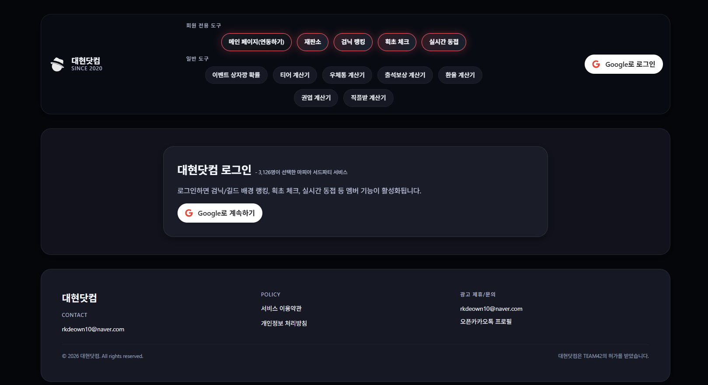
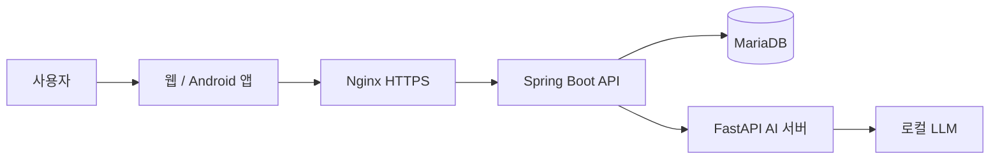

# 대현닷컴

### 마피아42를 더 편리하게 즐기기 위한 서드파티 서비스

 
 

 

<a href="https://xn--vk1b177d.com/">서비스 바로가기</a>

## About

대현닷컴은 마피아42 플레이어를 위한 기록, 랭킹, 계정 관리 서비스입니다.
2020년 9월부터 실서비스를 운영하며, 사용자 피드백을 바탕으로 게임 기록 조회부터
리플레이 기반 게임플레이 피드백까지 기능을 확장해 왔습니다.

## 한눈에 보기

| 항목 | 내용 |
| --- | --- |
| 서비스 | 마피아42 편의기능 서비스 |
| 운영 기간 | 2020.09 - 현재 |
| 운영 상태 | 실 운영 서비스 |
| 가입자 | <!-- total-user-count:start -->3,131<!-- total-user-count:end --> |
| 비즈니스 | 광고 기반 수익 모델, 손익분기점 초과 |
| 플랫폼 | 웹, Android 앱 기반 |

## 주요 기능

- 마피아42 채널 조회와 게임 기록 검색
- 계정 연동 및 프로필, 전적 관리
- 일일 랭킹과 서버 검색, 페이지네이션
- 리플레이 링크 기반 플레이어, 직업 데이터 확인
- 사용자 투표와 댓글이 결합된 리플레이 재판소
- 채팅 로그를 분석하는 비동기 AI 게임플레이 피드백
- Google OAuth 기반 로그인과 계정별 기능 제공

## 기술 구조

### Frontend

| 영역 | 기술 |
| --- | --- |
| Web | React, TypeScript, Vite |
| Mobile | Capacitor, Android, iOS 기반 |
| 인증 | Google OAuth, 모바일 딥링크, 보안 토큰 저장 |
| UI | Styled Components, React Router |

### Backend

| 영역 | 기술 |
| --- | --- |
| Runtime | Java 21, Spring Boot 3.5 |
| API | Spring MVC, Springdoc OpenAPI |
| 인증/보안 | Spring Security, Google OAuth2, JWT |
| 데이터 | MariaDB, Spring Data JPA |
| 운영 관측성 | Actuator, Prometheus, Grafana |
| 배포 | Docker Compose, Nginx, GitHub Actions, GHCR |

### AI

| 영역 | 기술 |
| --- | --- |
| 분석 서버 | Python, FastAPI, uv |
| 추론 | 로컬 LLM 연동 |
| 입력 | 마피아42 리플레이 채팅 로그와 플레이 맥락 |
| 처리 | 비동기 분석 요청, 상태 추적, 실패 재시도 |
| 연동 | Spring Boot 백엔드와 분리된 HTTP API |

## Engineering Highlights

### 조회 성능 개선

- 요청마다 전체 데이터를 계산하던 일일 랭킹 API를 사전 계산된 스냅샷 조회 구조로 전환
- 조회 패턴에 맞춘 복합 인덱스와 서버 검색, 페이지네이션 적용
- 60초 TTL 인메모리 캐시와 스케줄러 기반 스냅샷 갱신으로 반복 조회 부하 완화
- 운영 DB 기준 DB 조회 시간 약 7배 개선, API 응답 payload 약 33배 절감

### AI 게임플레이 피드백

- 사건 생성 시 리플레이 채팅 데이터를 AI 분석 파이프라인으로 전달
- 게임 내 발언과 판단 흐름을 바탕으로 플레이 맥락과 팀 기여도를 분석
- 분석 시간이 긴 로컬 LLM 호출은 백엔드 요청과 분리해 비동기로 처리
- 실패 요청은 상태를 기록하고 재시도할 수 있도록 설계

### 운영 인프라

- Oracle Cloud Free Tier 기반의 비용 효율적인 운영 환경 구성
- Docker Compose로 애플리케이션, 데이터베이스, 모니터링 구성 관리
- Blue-Green 배포와 Nginx 트래픽 전환으로 서비스 중단 최소화
- MariaDB와 Prometheus/Grafana 관리 포트는 외부에 직접 공개하지 않고 로컬 바인딩으로 격리
- GitHub Actions에서 백엔드 빌드, Docker 이미지 생성, GHCR push, 운영 서버 배포 자동화

## Core Repositories

조직에서는 대현닷컴 구현을 포크한 아래 세 저장소를 핵심 제품 코드로 관리합니다.

| 저장소 | 역할 |
| --- | --- |
| [daehyun-frontend](https://github.com/daehyun-project/daehyun-frontend) | 웹 클라이언트와 Capacitor 기반 모바일 앱 |
| [daehyun-backend](https://github.com/daehyun-project/daehyun-backend) | 사용자, 기록, 랭킹, 재판소, 인증 API와 운영 서버 |
| [daehyun-ai](https://github.com/daehyun-project/daehyun-ai) | 리플레이 채팅 분석과 게임플레이 피드백 AI 서버 |

## 운영 기록

대현닷컴은 기능을 한 번 만들고 끝내는 프로젝트가 아니라, 실제 사용자의 문제를 관찰하고
서비스에 반영하는 것을 목표로 운영하고 있습니다.

- 2020.09 - 서비스 운영 시작
- 사용자 계정 연동과 전적, 기록 조회 기능 확장
- 일일 랭킹 조회 구조 및 API 응답 최적화
- 리플레이 기반 사용자 참관 재판소 기능 구현
- 로컬 GPU 서버와 연동한 AI 게임플레이 피드백 파이프라인 구축

### Built and operated by Daehyun

